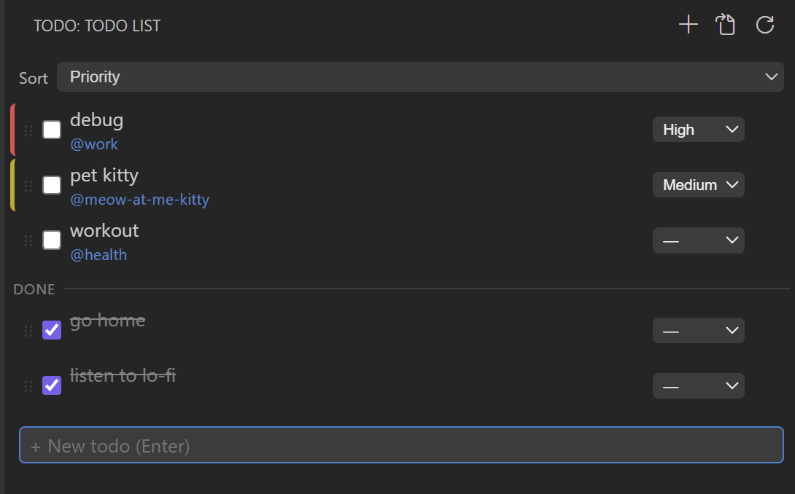
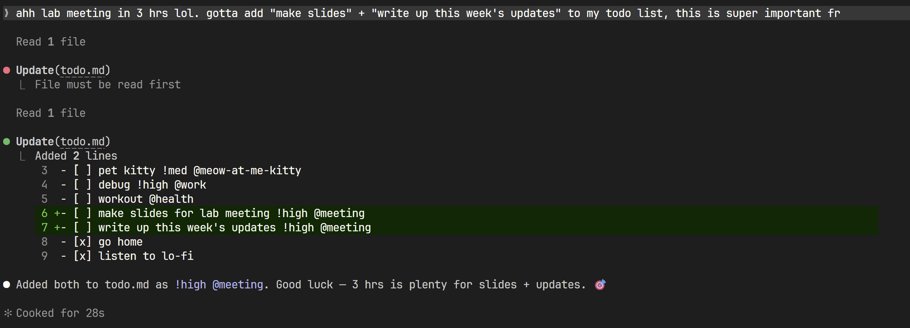
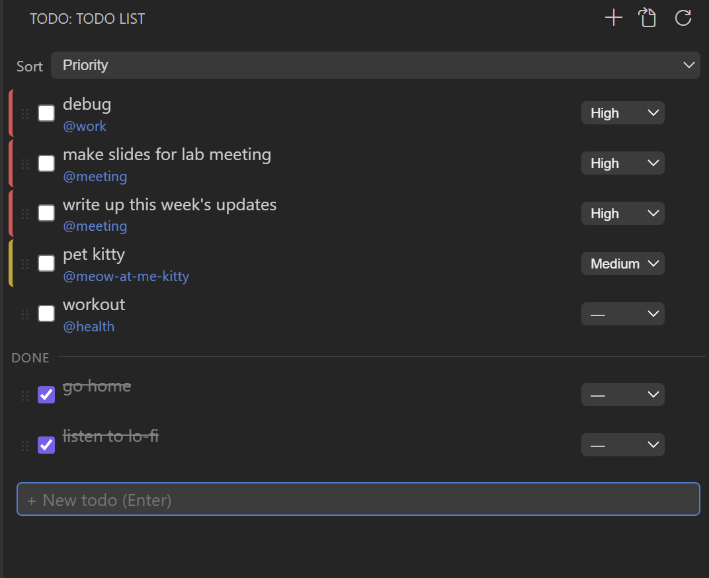

# Todo List for Claude Code

A todo list that lives in your VS Code **sidebar**, backed by a plain `todo.md`
file in your workspace root — so you can hand-edit it, track it in git, and have
**Claude Code add tasks for you** when you mention them in chat.

**[GitHub repository](https://github.com/meow-at-me/todolist-for-claude-code)** · [Marketplace](https://marketplace.visualstudio.com/items?itemName=meow-at-me.todolist-for-claude-code)



## Features

- Sidebar (activity bar) webview showing your todo list
- Add / check off / delete tasks
- Double-click to edit text, click the tag to set a category
- Priority levels (high / medium / low) shown as a colored accent bar
- Sort by manual order, priority, or category; completed items drop below a divider
- Drag to reorder
- Auto-refreshes when `todo.md` is edited directly (by you or by Claude Code)
- **Claude Code integration**: say something like "I need to send an email later"
  in chat and it's automatically added to `todo.md`
- Customizable priority colors (see Settings)
- UI follows your VS Code display language (English by default, Korean included)

## `todo.md` format

```markdown
# TODO

- [ ] Read the paper !high @research
- [x] Code review @dev
- [ ] Prepare for the meeting !low
```

- `- [ ]` / `- [x]` — open / done
- `!high` `!med` `!low` — priority
- `@word` — category

Line order is the display order; everything is human-editable.

## Claude Code integration

On first run the extension asks whether to connect with Claude Code. If you
accept, it adds a small managed block (`<!-- todolist-extension:start ... end -->`)
to your `~/.claude/CLAUDE.md`. After that, whenever you mention an upcoming task
while chatting with Claude Code, it appends the task to your workspace's `todo.md`
and the sidebar updates automatically.

Just mention your tasks in chat:



…and they show up in the sidebar instantly:

| Before | After |
|:---:|:---:|
|  |  |

To set it up again later, run **"Todo: Set up Claude Code integration"** from the
Command Palette.

## Settings

| Setting | Description |
|---|---|
| `todolist.colors.high` | Accent color for high-priority items (e.g. `#f14c4c`, `red`, `var(--vscode-charts-red)`). Empty = theme color. |
| `todolist.colors.med` | Accent color for medium-priority items. |
| `todolist.colors.low` | Accent color for low-priority items. |
| `todolist.colors.doneOpacity` | Opacity of completed items (0–1, e.g. `0.5`). Empty = default `0.55`. |

Changes apply live — no reload needed.

## Development

```bash
npm install
npm run compile   # or: npm run watch
```

Open this folder in VS Code and press `F5` to launch the Extension Development
Host, then click the Todo icon in the activity bar.

The source lives at
**[github.com/meow-at-me/todolist-for-claude-code](https://github.com/meow-at-me/todolist-for-claude-code)**.

## License

[MIT](LICENSE)
